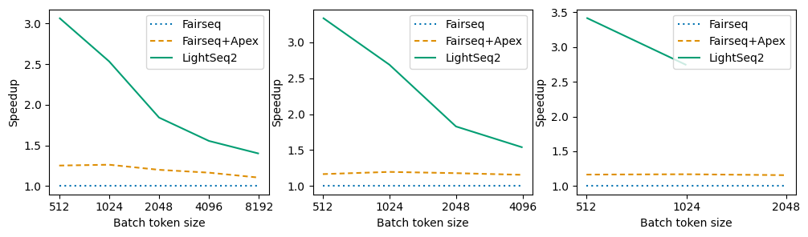
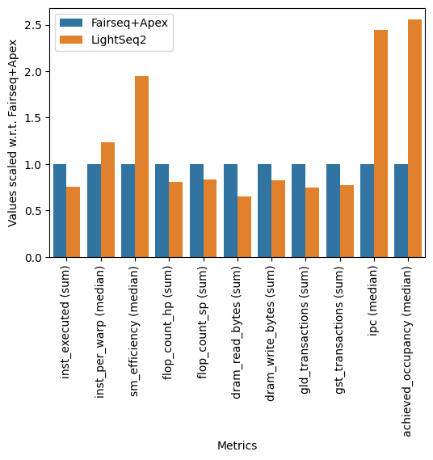

# HPML Final Project - Performance Optimization in Transformer Training: A Comparative Analysis of LightSeq2 and Fairseq

## Project Description

Transformer-based architectures have become foundational in natural language processing (NLP) and computer vision (CV). However, training these models is computationally expensive, requiring significant GPU resources and optimization. The need for more efficient training methods has become increasingly critical as model sizes continue to grow.

Despite the widespread adoption of Transformer models, training these architectures remains computationally intensive. Existing libraries like [Fairseq](https://github.com/facebookresearch/fairseq) have limitations in training speed, memory efficiency, and GPU utilization.

[LightSeq2](https://github.com/bytedance/lightseq), an accelerated training library for Transformer-based models, has been shown to achieve up to 3.5× speedup over Fairseq, a popular open-source training library. This report investigates the performance advantages of LightSeq2 over Fairseq for training a full Transformer for a machine translation task, with an emphasis on reproducing and analyzing results from the [LightSeq2 paper](https://arxiv.org/abs/2110.05722). Through a series of controlled experiments for different model and batch sizes, we explore training speed, memory efficiency, and kernel optimizations using NVIDIA Profiler (nvprof). Using experimental results, we explain why LightSeq2 performs better, providing insights into LightSeq2’s design, including GPU utilization improvements, mixed-precision training, and advanced memory management techniques. The findings confirm LightSeq2’s consistent performance advantages and scalability across different model sizes and explain how its internal architecture allows it to achieve this performance gain.

## File Hierarchy

```text
.
├── create_performance_plots.py    # Creates Fairseq vs. LightSeq2 performance plots
├── create_profiling_plots.py      # Creates Fairseq vs. LightSeq2 profiling metrics plot
├── fairseq_transformer.sh         # Runs the model training using Fairseq
├── install_apex.sh                # Installs Apex
├── lightseq_transformer.sh        # Runs the model training using LightSeq2
├── outputs                        # Holds the logs from the training experiments ran in run.sh
│   └── ...
├── plots                          # Holds the plots created from the logs during run.sh
│   └── ...
├── profiles                       # Holds the logs from the profiling experiments ran in run.sh
│   └── ...
├── run.sh                         # Runs all experiments and makes plots to analyze the performance
├── setup.sh                       # Installs all dependencies except for Apex
└── README.md
```

## Running Code

### Create VM Instance on GCP

1. Select region and zone that gives you at least 1 V100 GPU. For us, europe-west4-c worked every time.
2. Machine Configuration: GPUs
   - GPU Type: NVIDIA V100
   - Number of GPUs: 1
   - Machine Type: n1-highmem-8 (8 vCPU, 4 core, 52 GB memory)
3. OS and Storage (Boot disk):
   - Operating System: Deep Learning on Linux
   - Version: Deep Learning VM with CUDA 11.3 M112
   - Boot disk type: Balanced persistent disk
   - Size (GB): 100

### Install Dependencies & Run all Experiments

1. SSH into VM and load/unzip this code.
2. Change permission of `run.sh`: run `chmod +x run.sh`
3. Execute `run.sh`: run `./run.sh`

This will install all dependencies and run all experiments creating the necessary logs, which it then uses to create the plots that analyze the performance. At the end of the run `outputs` and `profiles` should be populated with .txt log files and `plots` should contain .png files of the different plots similar to those highlighted in the Results section below and in our corresponding report.

## Results

### A. Overall Performance Results

Speedup Plots:



In the above plots, starting from left to right we have the three different model sizes: 6 encoders and 6 decoders (6e6d), 12e12d, and 18e18d.

First we reproduced the results from the [original paper](https://arxiv.org/abs/2110.05722). We see the results from the original paper (Fig. 10 (a-c) in the original paper) run on the 8 V100 Tesla GPUs. In the above figure, we see our reproduced results run on a 1 V100 GPU. In the original paper, for the 6e6d model size we see about  a 1.4-2.4× speedup, the 12e12d model size achieved 1.5-3.0× speedup, and the 24e24d model size achieved a 1.8-2.8× speedup. In our study, the 6e6d model size achieves a 1.5-3.0× speed, the 12e12d model size achieves 1.6-3.3× speedup, and since we could not do a 24e24d model size due to hardware limitations we instead did an 18e18d which achieves 2.5-3.4× speedup. Ultimately we see similar results across all model size and batch size variations. Differences in results could be due to different hardware setups (1 GPU vs. 8 GPUs) or different software setup (different versions of PyTorch and other dependencies).

### B. Profiling Results



The profiling results can be found above. We printed out the metrics per GPU trace, we then aggregated the metrics across all kernels. For each metric we chose an appropriate statistic to use when aggregating. For example, when looking at the number of kernel instances executed, we took the sum, which effectively represents the total number of kernel instances executed across all kernels, which is different from the statistic we used on an efficiency metric where the sum intuitively does not makes sense, instead in these cases we decided the best metric is the median across all kernels. After aggregating the two, to effectively compare LightSeq2 to Fairseq with Apex optimization, we normalize both values by dividing by the results from the Fairseq run.

***Kernel Fusion and Computational Graph Optimizations.*** For the kernel fusion and computational graph optimizations, we chose to record the number of executed instructions (`inst_executed`), instructions per warp (`inst_per_warp`), and streaming multiprocessor utilization (sm_efficiency). For `inst_executed`, we see that LightSeq2 has about 0.76× the number of instructions executed showing that LightSeq2 has fewer kernel invocations and thus reduced overhead from kernel launching. For `inst_per_warp` we see LightSeq2 has 1.23× the number of instructions per warp and for sm_efficiency we see LightSeq2 has 1.95× the streaming multiprocessor utilization, which indicates that fused kernels in LightSeq2 have better GPU utilization.

***Fine-Grain Mixed-Precision Training.*** For fine-grain mixed-precision training, we chose to record the number of half-precision floating-point operations (FP16) executed (`flop_count_hp`), the number of single-precision floating-point operations (FP32) executed (`flop_count_sp`), and the number of bytes read/written from/to device memory (DRAM) (dram_read_bytes/dram_write_bytes). For `flop_count_hp`, we see LightSeq2 has 0.81× the number of FP16 operations and 0.83× FP32 operations (for `flop_count_sp`) which shows an overall less number of floating-point operations used in LightSeq2 compared to Fairseq. For dram_read_bytes and dram_write_bytes, LightSeq2 achieves 0.65× the amount of bytes read from DRAM and 0.83× bytes written to DRAM compared to Fairseq, indicating reduced DRAM memory traffic due to symbolic linking and fewer data conversion between FP16 and FP32.

***Improved Memory Management.*** For improved memory management, we chose to record the global memory load/store transactions (`gld_transactions` and `gst_transactions`). We see that LightSeq2 has 0.75× `gld_transactions` and 0.78× `gst_transactions` meaning there are fewer global memory transactions, which is likely due to avoiding frequent intermediate memory operations.

***Custom Optimized Layers and Trainers.*** For custom optimized layers and trainers, we chose to record instructions per cycle (`ipc`), ratio of the average active warps per cycle to the maximum number of warps (thread occupancy) (`achieved_occupancy`). Also we obtained these metrics per kernel by using `--print-gpu-trace` parameter of nvprof. For `ipc` and `achieved_occupancy` across kernels we see LightSeq2’s median instructions per cycle is 2.44× and median thread occupancy is 2.55× Fairseq’s. This indicates that there is consistent performance improvement across all layers including the custom optimized layers.
